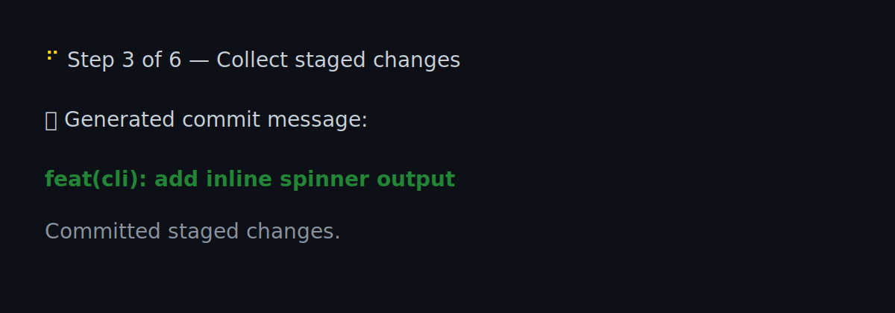

# $gh <✨/sparkle>

[](https://github.com/dyxushuai/gh-sparkle/actions/workflows/ci.yml)

A GitHub CLI extension that brings the VS Code "Generate Commit Message"
experience to your terminal. It reads staged changes, asks GitHub Models for a
Conventional Commit message, then commits automatically.
Built for large diffs: it summarizes, trims, and retries to stay within model
limits without breaking the flow.

## Why sparkle

The name comes from the ✨/sparkle icon used by VS Code's "Generate Commit
Message" feature. I wanted the same flow, but inside `gh`. `sparkle` keeps that
loop tight: stage, generate, commit.

## Large changes handling

`sparkle` is optimized for big diffs by combining a summary with a trimmed
patch. It avoids API failures by capping input size and retrying with a smaller
budget when needed. Input budgets and model policy are defined in
`assets/commitmsg.prompt.yml`.

## Features

- Copilot-style commit message generation from staged diffs
- Defaults to `auto` with safe input trimming for large changes
- Lightweight inline animation in interactive terminals
- Supports `--language`, `--examples`, and `--model`
- Commits staged changes automatically

## Prerequisites

- GitHub CLI installed and authenticated (`gh auth login`)
- A git repository with staged changes

If you use GitHub Enterprise, make sure your host is authenticated:

```bash
gh auth login --hostname <your-host>
```

## Installation

```bash
gh extension install dyxushuai/gh-sparkle
```

## Usage

Stage your changes and run:

```bash
git add .
gh sparkle
```

### Options

- `-l, --language <LANGUAGE>`: Output language for the commit message.
  Default: `english`.
- `-e, --examples[=<N>]`: Include recent commit messages as examples.
  If provided without a value, it uses `3`. Valid range: `1..=20`.
- `-m, --model <MODEL>`: GitHub Models model to use.
  Default: `auto` (resolved via `modelPolicy.autoModels` in the prompt config,
  tried in order until a request succeeds).

```bash
# Generate commit message in a different language
gh sparkle --language chinese

# Add previous commit messages as examples (default 3 when flag is present)
gh sparkle --examples

# Or specify the number of examples (max 20)
gh sparkle --examples 5

# Use a different GitHub Models model
gh sparkle --model xai/grok-3-mini
```

## Notes

- The extension commits automatically using the generated message.
- If there are no staged changes, it exits without committing.
- Large diffs are truncated to fit model input limits.

## Upgrade

```bash
gh extension upgrade sparkle
```
